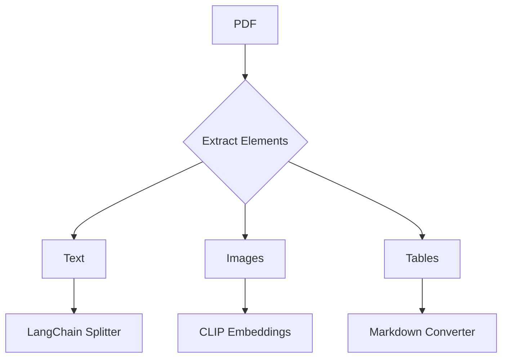

Here's the complete development plan for your open-source document ingestion pipeline using Python and FastAPI:

### 1. Core Modules & Technology Stack

| Module                  | Components                                                                 | Technology Stack                                                                 |
|-------------------------|----------------------------------------------------------------------------|-----------------------------------------------------------------------------------|
| **1. File Ingestion**    | - File upload API<br>- Storage monitoring<br>- File type detection         | FastAPI, Watchdog, python-magic, MinIO (S3-compatible)                            |
| **2. Document Processing** | - Text extraction<br>- Image processing<br>- Audio transcription          | Unstructured AI, PyMuPDF, pdf2image, pytesseract, Whisper                         |
| **3. Chunking Engine**    | - Text splitting<br>- Image tiling<br>- Audio segmentation               | LangChain TextSplitter, OpenCV, librosa                                           |
| **4. Metadata Management** | - Document relationships<br>- Folder hierarchy<br>- Version control      | PostgreSQL, NetworkX, SQLModel                                                    |
| **5. Embedding Generation** | - Text embeddings<br>- Image embeddings<br>- Multi-modal linking          | HuggingFace Transformers (BGE models), CLIP, SentenceTransformers                  |
| **6. Vector Storage**      | - Dense vector storage<br>- Hybrid search<br>- Payload filtering         | Qdrant (Open-Source)                                                              |
| **7. API Layer**           | - REST endpoints<br>- WebSocket support<br>- Authentication              | FastAPI, WebSockets, OAuth2                                                       |
| **8. Background Processing** | - Async tasks<br>- Queue management                                     | Celery/Dramatiq, Redis/RabbitMQ                                                   |
| **9. Security**            | - Data encryption<br>- Access control<br>- Audit logging                | AES-256, RBAC (Role-Based Access Control), SQLAlchemy-Continuum                   |
| **10. Monitoring**         | - Pipeline metrics<br>- Error tracking<br>- Performance alerts           | Prometheus, Grafana, Sentry                                                       |

---

### 2. Key Technology Choices

**Multi-Modal Processing**  


**Open Source Stack Advantages**  
- **Qdrant**: Native Python client, hybrid search capabilities  
- **FastAPI**: Async support, automatic OpenAPI docs  
- **Unstructured AI**: Handles 30+ file formats out-of-box  
- **HuggingFace**: State-of-art embedding models  

---

### 3. Development Roadmap

**Phase 1: Foundation (2 Weeks)**
1. Set up FastAPI core with:  
   ```python
   # Basic structure
   from fastapi import FastAPI
   from pydantic import BaseModel

   app = FastAPI()

   class Document(BaseModel):
       content: str
       file_type: str

   @app.post("/ingest")
   async def ingest_file(file: UploadFile):
       # Basic ingestion logic
       return {"status": "received"}
   ```
2. Configure MinIO for user buckets
3. Implement basic text extraction (PDF/TXT)

**Phase 2: Processing Pipeline (3 Weeks)**
1. Integrate Unstructured AI for document parsing  
2. Build chunking strategies:  
   ```python
   def chunk_document(content: str, strategy: str):
       if strategy == "text":
           return RecursiveTextSplitter(
               chunk_size=512, 
               chunk_overlap=64
           ).split_text(content)
       elif strategy == "image":
           return sliding_window_split(image)
   ```
3. Set up Qdrant collections per user  
4. Implement metadata relationships

**Phase 3: Multi-Modal Support (2 Weeks)**
1. Add CLIP image embeddings  
2. Integrate Whisper for audio  
3. Cross-modal linking system

**Phase 4: Security & Scaling (1 Week)**
1. Implement OAuth2 with JWT  
2. Set up Redis caching layer  
3. Configure Celery for async processing  

**Phase 5: Monitoring & Deployment (1 Week)**
1. Add Prometheus metrics  
2. Create Docker compose setup  
3. Implement CI/CD with GitHub Actions  

---

### 4. System Architecture

```
graph TD
    A[User] --> B[FastAPI]
    B --> C[MinIO Buckets]
    B --> D[Celery Workers]
    C --> E{Document Processor}
    E --> F[Text Pipeline]
    E --> G[Image Pipeline]
    E --> H[Audio Pipeline]
    F --> I[Qdrant]
    G --> I
    H --> I
    I --> J[Query Service]
    J --> K[UI/API Response]
    
    style A fill:#4CAF50
    style I fill:#2196F3
```

---

### 5. Key Implementation Patterns

**1. Hybrid Chunk Storage**  
```python
# Qdrant payload example
{
    "user_id": "usr_123",
    "content_type": "text/pdf",
    "linked_chunks": ["img_456", "audio_789"],
    "folder_path": "/research/2024",
    "version": "v2.1"
}
```

**2. Async Processing Flow**  
```python
@app.post("/upload")
async def upload_file(file: UploadFile = File(...)):
    task = process_file.delay(file.file.read())
    return {"task_id": task.id}

@celery.task
def process_file(content):
    # Long-running processing
    return store_in_qdrant(content)
```

**3. Security Implementation**  
```python
# RBAC Middleware
async def verify_role(request: Request):
    if not user_has_access(request.user, request.path):
        raise HTTPException(403)
```

---

### 6. Maintenance & Monitoring

**Key Metrics**  
- Ingestion latency  
- Chunk size distribution  
- Qdrant query performance  
- Error rates per file type  

**Alert Thresholds**  
```yaml
alert_rules:
  - metric: ingestion_latency_seconds
    threshold: >10s
    severity: critical
  - metric: qdrant_heap_usage
    threshold: >80%
    severity: warning
```

---

### Next Steps Recommendation
1. Start with Phase 1 setup  
2. Implement basic text processing  
3. Gradually add multi-modal support  

Want me to elaborate on any specific component or show sample code for critical paths?

Citations:
[1] https://firsteigen.com/blog/10-data-ingestion-tools-to-fortify-your-data-strategy/
[2] https://www.multimodal.dev/post/how-to-chunk-documents-for-rag
[3] https://lakefs.io/blog/12-vector-databases-2023/
[4] https://www.francoisvoron.com/blog/create-deploy-reliable-data-ingestion-service-fastapi-sqlmodel-dramatiq
[5] https://dev.to/oooodiboooo/writing-a-search-engine-from-scratch-using-fastapi-and-tantivy-4ldb
[6] https://dev.to/devasservice/fastapi-best-practices-a-condensed-guide-with-examples-3pa5
[7] https://airbyte.com/top-etl-tools-for-sources/data-orchestration-tools
[8] https://www.aihello.com/resources/blog/building-a-rag-pipeline-with-fastapi-haystack-and-chromadb-for-urls-in-python/
[9] https://www.getorchestra.io/guides/fastapi-model-indexing-accessing-model-fields-dynamically-using-indexing
[10] http://www.dataairevolution.com/2024/08/building-automating-a-structured-data-pipeline-with-mysql-fastapi-and-python/
[11] https://www.amax.com/top-5-open-source-vector-databases-for-scalable-ai-solutions/
[12] https://www.matillion.com/learn/blog/data-ingestion-tools
[13] https://learn.microsoft.com/en-ie/azure/search/vector-search-how-to-chunk-documents
[14] https://www.shakudo.io/blog/top-9-vector-databases
[15] https://www.montecarlodata.com/blog-8-data-ingestion-tools-reference-guide/
[16] https://www.reddit.com/r/LlamaIndex/comments/1dicqkt/best_open_source_document_parser/
[17] https://www.reddit.com/r/LangChain/comments/170jigz/my_strategy_for_picking_a_vector_database_a/
[18] https://www.integrate.io/blog/top-data-ingestion-tools/
[19] https://www.pinecone.io/learn/chunking-strategies/
[20] https://www.linkedin.com/pulse/genai-dev-stack-llmops-vector-databases-pavan-belagatti-wmcmc
[21] https://www.reddit.com/r/dataengineering/comments/117r4gd/open_source_ingestion_tool/
[22] https://docs.llamaindex.ai/en/stable/understanding/indexing/indexing/
[23] https://fastapi.tiangolo.com/tutorial/bigger-applications/
[24] https://www.reddit.com/r/LangChain/comments/1e9j3cq/built_a_rag_system_for_internal_documents_using/
[25] https://stackoverflow.com/questions/70118412/keeping-endpoint-function-declarations-in-separate-modules-with-fastapi
[26] https://stackoverflow.com/questions/63048825/how-to-upload-file-using-fastapi/70657621
[27] https://www.youtube.com/watch?v=GE1N0ufvOxQ
[28] https://fastapi.tiangolo.com
[29] https://www.reddit.com/r/Python/comments/wrt7om/fastapi_best_practices/
[30] https://blog.ionxsolutions.com/p/file-uploads-with-python-fastapi/
[31] https://github.com/zhanymkanov/fastapi-best-practices/activity
[32] https://stackoverflow.com/questions/71765778/how-to-process-files-in-fastapi-from-multiple-clients-without-saving-the-files-t/71766160
[33] https://stackoverflow.com/questions/70617121/how-to-upload-a-csv-file-in-fastapi-and-convert-it-into-json
[34] https://www.youtube.com/watch?v=SORiTsvnU28
[35] https://cloud.google.com/generative-ai-app-builder/docs/parse-chunk-documents
[36] https://www.instaclustr.com/education/top-10-open-source-vector-databases/
[37] https://www.quivr.com/blog/quivr-made-an-open-source-document-parsing-tool
[38] https://www.ibm.com/architectures/papers/rag-cookbook/chunking
[39] https://fastapi.tiangolo.com/tutorial/first-steps/
[40] https://realpython.com/fastapi-python-web-apis/